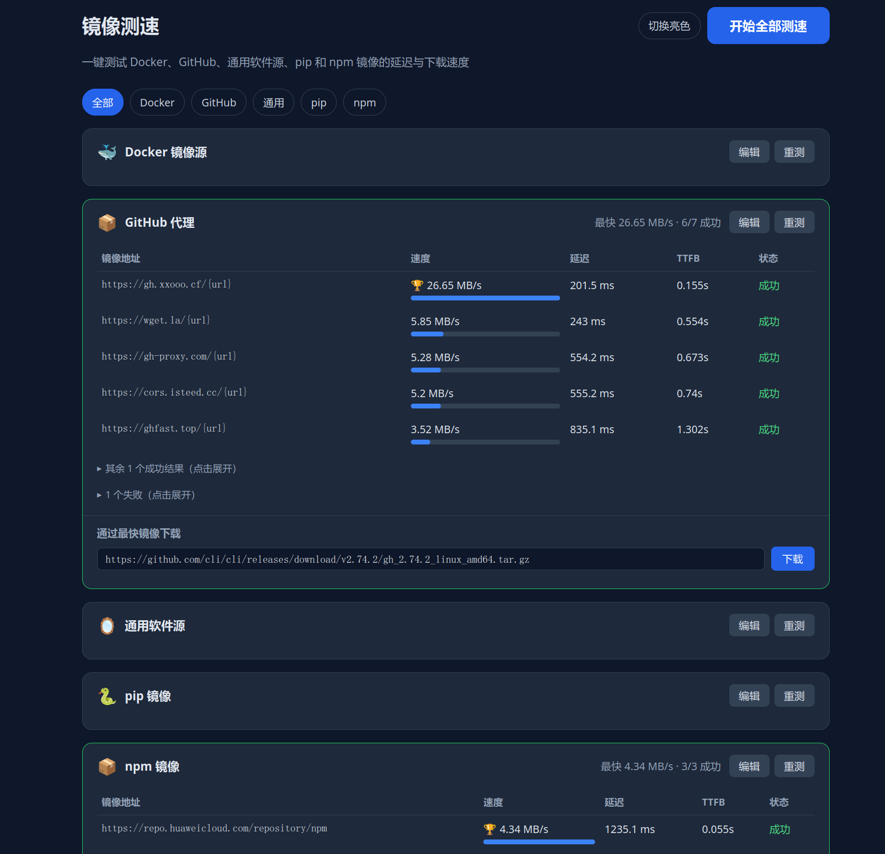

# 镜像测速

[](https://www.python.org/)
[](./LICENSE)
[](https://github.com/fa1seut0pia/mirror-speed-test/releases)
[](https://github.com/fa1seut0pia/mirror-speed-test/actions/workflows/release.yml)

<p align="center">
  
</p>

一个零依赖的 Python 小工具，一键测试常见镜像源的延迟与下载速度。

## 功能

- 内置 16 类镜像源，开箱即用（含 Docker、GitHub、开发语言源、Linux 软件源）
- 单类别并发测速（默认并发 4），展示速度、延迟、TTFB，结果按速度排序
- 支持编辑镜像、测试目标和采样大小；支持失败镜像禁用/清空禁用
- 配置修改仅当前会话生效；本地测速结果支持缓存与一键清理

## 运行

```bash
git clone https://github.com/fa1seut0pia/mirror-speed-test.git
cd mirror-speed-test
python3 app.py
```

或者从 [Releases](https://github.com/fa1seut0pia/mirror-speed-test/releases) 下载后运行

Linux/macOS ：

```bash
chmod +x mirror-speed-test*
./mirror-speed-test-*
```

Windows （PowerShell）：

```powershell
.\mirror-speed-test-windows-x64.exe
```

默认监听 `http://127.0.0.1:8080`。
如果端口被占用，会自动递增尝试下一个可用端口。

## Docker

本地构建和运行：

```bash
docker build -t mirror-speed-test:local .
docker run --rm -p 8080:8080 mirror-speed-test:local
```

或者：

```bash
docker run --rm -p 8080:8080 ghcr.io/fa1seut0pia/mirror-speed-test:latest
```

## 可选环境变量

| 变量 | 默认值 | 说明 |
|------|--------|------|
| `MST_HOST` | `127.0.0.1` | 监听地址 |
| `MST_PORT` | `8080` | 监听端口 |

## 开源协议

本项目使用 [MIT License](./LICENSE)。

## 注意事项

- 这是后端测速，不受浏览器 CORS 限制
- 速度结果反映样本文件下载表现，不完全等价于 `docker pull` / `npm install` 等工具的最终体验
- 某些镜像站可能不支持 `Range`；服务会尽量读取前 N MB 后提前结束
- 多次测速可能受到镜像站缓存、限流和线路波动影响

## 致谢

特别感谢 [Linux.do](https://linux.do) 社区提供的支持与反馈。
